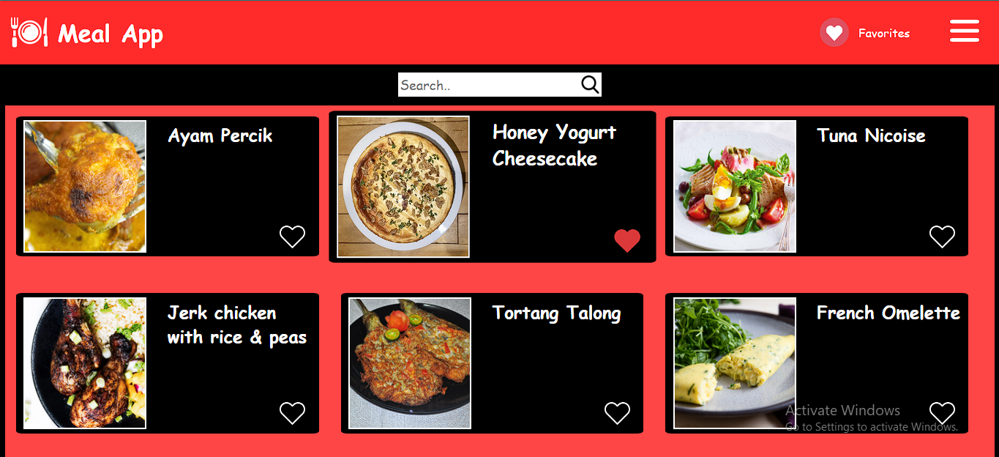
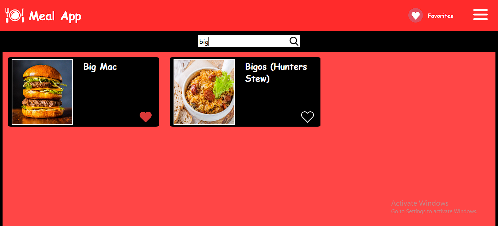
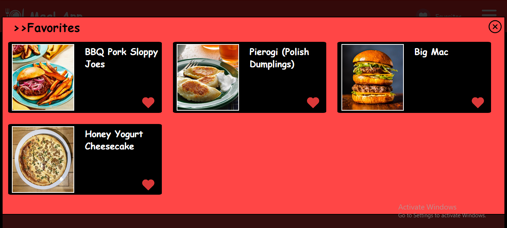
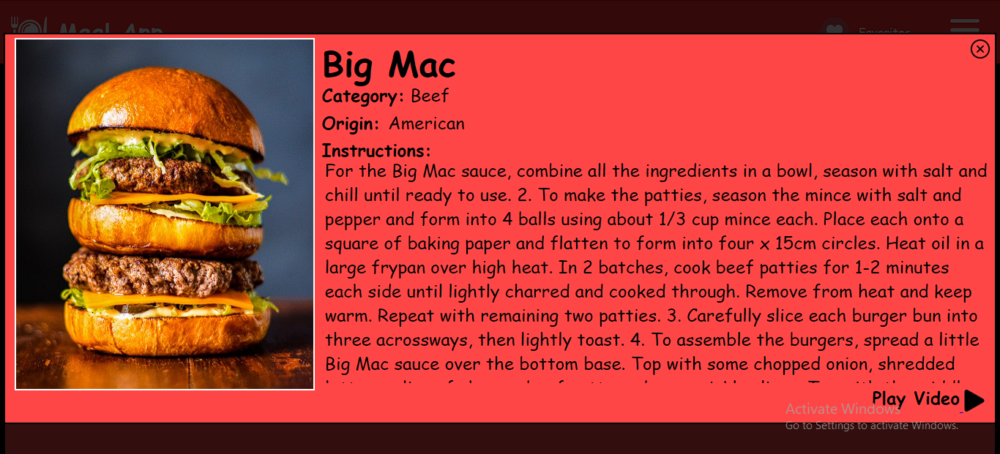
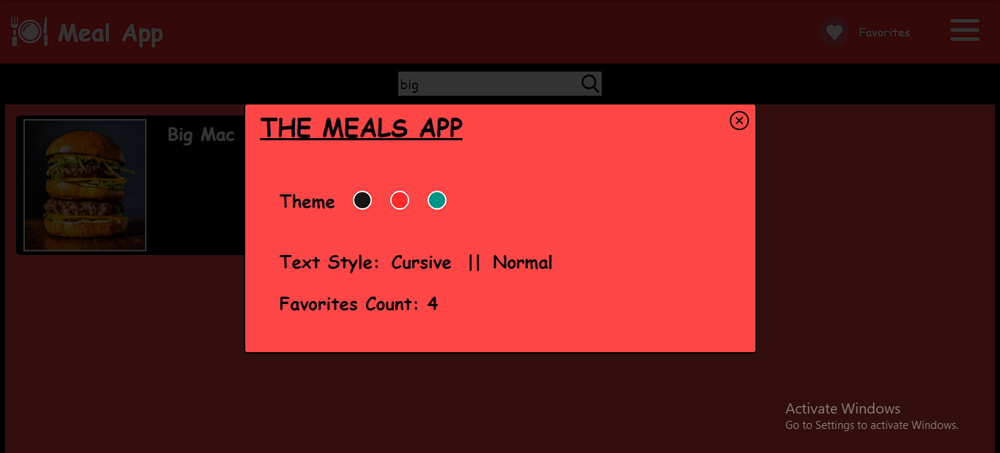

# Meal-App

The Meal App is a web application developed with the help of HTML, CSS and Javascript.It allows users to explore various meal recipes and save their favorite recipes.It provides a user-friendly interface for searching meals, viewing detailed descriptions, and managing favorite items.

## Technologies Used

- HTML
- CSS
- JavaScript

## Features

- Users can search for meal recipes using the search input. As they type, the app dynamically fetches matching recipes and displays them on the screen.
- Upon app startup, six random meal items are loaded and displayed on the main screen.
- Users can mark meal items as favorites by clicking the "Add to Favorite" button.
- The favorites are stored in the browser's local storage, enabling users to access their favorite items even after closing the app.
- The app displays the count of favorite items in the menu bar. Users can click on the count to navigate directly to their favorite items.
- Clicking on a meal item displays a detailed description of the selected recipe.
- The description includes the item's image, name, category, origin, cooking instructions, and a link to a video tutorial.
- The app provides theme customization options, allowing users to change the color scheme and font style.
- Users can choose from predefined color themes and switch between cursive and normal font styles.

## Usage

1. Search for meal recipes by entering keywords in the search input.
2. Explore the random meal items displayed on the main screen.
3. Click on a meal item to view its detailed description.
4. Add meal items to favorites by clicking the "Add to Favorite" button.
5. Access favorite items by clicking on the "Favorites" option in the navigation bar.
6. Customize the app's theme by selecting different color options and font styles in the menu.

## Installation

To run the Meal App locally:

1. Clone the repository to your local machine.
3. Open the `index.html` file in a web browser.
4. Start using the Meal App to explore different recipes.

to run the Meal App online:
1. go to httpshttps://kkbhati07.github.io/Meal-App/ from your browser.

## Screenshots

